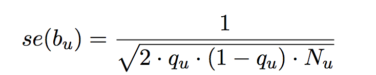

[//]: ==================================
# Manual of SSimp
[//]: ==================================

## Minimal example
[//]: -------------------------------
The minimal requirements are for `ssimp` to run are: (1) GWAS summary statistics stored in a text file with at least the following columns SNP-id (e.g. `MarkerName`), Z-statistic (e.g. `Z`), reference allele (e.g. `a1`) and risk allele (e.g. `a2`) and at least one row, (2) the path to the reference panel, and (3) the path to the output file.

`ssimp my_gwas.txt ~/.refpanel/my_reference_panel.vcf output.txt` 

will generate a file `output.txt`, containing the imputation results. This is identical to 

`ssimp --gwas my_gwas.txt --ref ~/.refpanel/my_reference_panel.vcf --out output.txt`
	
An executable example is:

`ssimp --gwas gwas/small.random.csv --ref ref/small.vcf.sample.vcf.gz --out output.txt --impute.range`

## Options
[//]: -------------------------------
The options `--gwas`, `--ref` and `--out` are required arguments. Some options (e.g. `--lambda`) have `[defaults]` defined, and other options (e.g. `--log`) are entirely optional.

Note that arguments can be shortenend, e.g. `--wind` instead of `--window.width`.

`--gwas [no default]`, path to the GWAS dataset. The file's extension (e.g. `.txt`) does not matter. The delimiter (comma, space or tab) is detected automatically. Common column names are recognised automatically (for details see section `GWAS dataset`). The minimal set of columns that should be provided, are: SNP-id, Z-statistics, reference allele and risk allele. Missings have to be marked as `NA` or left empty.

`--ref [no default]` path to vcf file (same folder should contain the `tbi` file). 

`--out [no default]` string. Filename to store the imputation results. 

`--sample.names [no default]`  The argument can be used in two ways: (1) providing a text file (no header) with sample id's separated by new lines `--sample.names filename.samples.txt` or (2) providing a file with at least a sample id column and a column to constrain on: `--sample.names  x/f/e=v` does a lookup in file 'x' (which has a header), but filters on field 'e' being equal to value 'v', and then
use the sample names in column 'f'. An example of the latter is: `integrated_call_samples_v3.20130502.ALL.panel/sample/super_pop=EUR`. 

`--log [no default]` string. Filename in which to store the log file - this is simply a copy of whatever is printed to the console.

`--impute.range [no default]` Should have the form of `CHR:pos.start-CHR:pos.end`, with `CHR` being the chromosome number, `pos.start` the start position and `pos.end` the end position, e.g. `1:10000-1:30000`. If `CHR`, then the single chromosome `CHR` is imputed. For `CHR-CHR`, a range of chromosomes are imputed, e.g. `1-5` chromosome 1 to chromosome 5 are imputed.

`--tag.snp [no default]` filename with a list of tag SNPs (each SNP has a new line, no header). For magic in bash see `Note` below.

`--impute.snp [NULL]` filename to define SNPs to impute (each SNP has a new line, no header). For magic in bash see `Note` below.

`--lambda [2/sqrt(n)]` numeric value or string (`2/sqrt(n)`), n are the number of individuals in the reference panel. Lambda (λ) controls the shrinking of the correlation matrix (lambda = 0 applies no shrinking, lambda = 1 turns the correlation matrix into the identity matrix).

`--impute.maf [0]` numeric value. Lower MAF limit for SNPs to be imputed: everything above and equal this threshold will be imputed.

`--tag.maf [0]` numeric value. Lower MAF limit for tag SNPs: everything above and equal this threshold will be used as tag SNPs. 

`--window.width [1000000]` numeric value. Core window length. See illustration below.

`--flanking.width [250000]` numeric value. Flanking space left/right of the core window. See illustration below.
		
`--missingness [none]` string: `ind` (recommended), `dep`. Enables variable sample size approach. `ind` stands for independent, and `dep` for dependent. 

`--n.cores [1]` Number of cores to use (will be implemented around November 2017). Have a look at the workaround below.

### Multiprocessing
[//]: -------
Note that multiprocessing mode is not yet implemented, hence to speed up computation we recommend splitting up the job to smaller chromosomal chunks using the option `--impute.range`:

`ssimp --gwas gwas/small.random.csv --ref ref/small.vcf.sample.vcf.gz --out output.txt --impute.range 22:16000000-22:16050075`

### Note	
[//]: -------
- If `impute.range` and `impute.snps` are not defined, then all variants in the reference panel are imputed (including the tag SNPs of the first window for sanity checks, see section `output` below).
- Magic tip in bash to produce a file within the command line: `--impute.snp <(echo rs5753220 rs5753231 | tr ' ' '\n')`. Have a look at the [examples](https://github.com/sinarueeger/ssimp_software/blob/master/docu/examples.md).

## GWAS dataset
[//]: -------------------------------
- Column names are automatically recognised using commonly used names. See subsection below.
- Odds ratios need to be provided as Z-statistics or, alternatively, be log-transformed into effect sizes (`b`).
- The minimal columns required are `SNP`, `A1`, `A2`, `Z`. If `Z` is not present, but `P` and `b` are, `Z` is calculated through `P` and `b`. 
- Missing values should be marked as `NA` or left empty. 
- Positions should match the positions in the reference panel (e.g. both hg19). 
- It is recommended to provide the sample size (N) and set `--missingness dep`, as incorporating missingness leads to a more accurate estimate. 
- SNP names should be named so they match the SNP-id in the reference panel. E.g. if the reference panel uses `chr:pos`, the GWAS should have the same SNP identifier.
- In case no SNP identifiers are present, use `chromosome` and `position`, but provide a `SNP` column with empty entries.
- If case positions in the GWAS file do not match the reference panel positions, use use LiftOver as a command line tool: http://genome.ucsc.edu/cgi-bin/hgLiftOver.

### Automatic header recognition
The column identifying the
- **SNP-id** should be named: `ID`, `rnpid`, `snpid`, `rsid`, `MarkerName`, `snp`, `id1` or `marker`.
- **reference allele** should be named: `REF`, `a1`, `Allele1`, `AlleleA` or `other_allele`.
- **effect allele** should be named: `ALT`, `a2`, `Allele2`, `AlleleB` or `effect_allele`.
- **Z-statistic** should be named: `z.from.peff`, `z`, `stat`, `zscore` or `z.score`. 
- **P-value** should be named: `p`, `P-value`, `P.value`, `PVALUE`, `frequentist_add_pvalue` or `normal.score.p`.
- **Effect size** should be named: `b`, `beta`, `ALT_EFFSIZE`, `frequentist_add_beta_1` or `normal.score.beta`.
- **Standard error** should be named: `se`, `frequentist_add_se_1` or `normal.score.se`.
- **Sample size** should be named: `n`, `NMISS` or `all_total`
- **Chromosome** should be named: `chr`, `chromosome`, `chrm` or `#CHROM`.
- **Position** should be named: `POS`,`position` or `BP`.

*Note*

Column names listed above are not case sensitive. E.g. P-value column can be named `p` or `P`.

## --window.width and --flanking.width
[//]: -------------------------------
To speed up computation, we use a sliding window approach (`--window.width` and `--flanking.width`). SNPs to be imputed are assigned to one window.

On each chromosome you can only impute variants that are in the range between **min(position)+flanking.width** to **max(position)-flanking.width**, the position being the position of all tag SNPs on a specific chromosome.

## Reference panel
[//]: -------------------------------
Filename specified as `ref/chr{CHRM}.vcf.gz`, with `CHRM` as the placeholder if the vcf.gz files are split up for each chromosome. The same folder should contain also the `.tbi` file(s).

More info on handling reference panel data can be found starting from line 49 in [usage message](https://github.com/sinarueeger/ssimp_software/blob/master/docu/usage.txt).

## Run-time
[//]: -------------------------------
To run a genome-wide imputation using 1000 genomes reference panel, roughly 200 CPU hours are needed.

## Technical aspects
[//]: -------------------------------

- If SNP-ID are present in the GWAS, then positions (bp) are copied from reference panel. 
- If SNP-ID are not present (e.g. filled with `.`), then the combination of Chr:Pos:A1:A2 are taken as identifier
- Because either SNP-ID or Chr:Pos:A1:A2 are used as identifier, it is also possible to impute indels.

## Output
[//]: -------------------------------

### log file
[//]: -------
The `.log` file is a copy of what is printed to the console. (not supported yet)

### out file
[//]: -------
The output file specified in `--out` file has the following columns:
- `chr` Chromosome (only 1 to 22 right now)
- `pos` Position (same build as reference panel)
- `z_imp` Imputed Z statistics (see below)
- `source` GWAS or SSimp, depending if the SNP was a tag SNP or an imputed SNP. 
- `SNP` SNP-ID
- Reference allele (same column name as in the GWAS file)
- Effect allele (same column name as in the GWAS file)
- `maf` minor allele frequency in reference panel
- `r2.pred` Imputation quality (as defined in the Method outline)
- `lambda` lambda used to penalise.
- `Z_reimputed` imputed Z-statistics for tag SNPs for the first window (sanity check).
- `r2_reimputed` imputation quality for the imputed tag SNPs of for the first window (sanity check).

Note that `Z_imp` reports the imputed Z-statistics for SNPs that were imputed (`origin = SSimp`), as well as the GWAS Z-statistics for tag SNPs (`origin = GWAS`). 

Other summary statistics can be easily calculated from the output above:
- `N_imp` Effective sample size after imputation (maximal sample size times the imputation quality (r2.pred))
- `P_imp` Imputed P-value [2*CDF(-|z_imp|)]
- `bst_imp` Imputed standardised effect size [z_imp/sqrt(N_imp)]

## Method outline
[//]: -------------------------------
The principle of *summary statistics imputation* is to combine the available summary statistics from a set of markers and the fine-scale LD structure in the same region in order to infer association summary statistics of unobserved variants. We can formally write this using the conditional expectation of a multivariate normal distribution. 

Here we aim to impute the **Z-statistic** of an untyped SNP *u*, given the Z-statistics of a set of tag SNPs called *M* (LHS of the equation). The RHS of the equation contains **c** (representing the correlations between SNP *u* and all the tag SNPs *M*), **C** (the pairwise correlations among the tag SNPs), and the Z-statistics of a set of tag SNPs *M*. Both, **c** and **C** are regularised using the option `--lambda`. *u* can be extended to a vector. SNPs to impute are in a core window (of size `--window.width`) and *M* is the set of tag SNPs within the core window +/- a flanking region (of size `--window.width`).

### Imputation quality
The estimated imputation quality is a measure that varies between 0 and 1, with 0 reflecting poor and 1 perfect imputation. We use an adjusted R2 estimation that is additionally corrected by the effective number of tag SNVs `p_eff` (`n`=number of individuals in the reference panel).

### Variable missingness
To account for variable sample size in summary statistics of tag SNVs, we use an approach to down-weight entries in the **C** and **c** matrices for which summary statistics was estimated from a GWAS sample size lower than the maximum sample size in that dataset. Using such down-weighting, turns matrices **C** and **c** into **D** and **d**. Subsequently, the matrices are used for imputation of summary statistics as well as the calculation of the imputation quality. 

### Transform Z-statistics to `b` and `se(b)`
Imputed Z-statistics can be transformed into effect sizes (`b`) and standard errors of effect sizes (`se(b)`).

The calculation depends on the type of model used for your GWAS summary statistics. 

If your Z-statistics originated from a linear regression model, the estimated `se(b)` can be approximated by:

with `q_u` being the allele frequency and `N_u` the sample size of SNP `u`. We can approximate the sample size of an untyped SNP by multiplying the maximum sample size with its imputation quality `N_u = N_max * r2_pred`. 

[Here](https://github.com/sinarueeger/ssimp_software/blob/master/transform_z_to_b.R) we provide an R-function that automatically transforms imputed Z-statistics into imputed effect sizes.

### More background on method

For more details on *summary statistics imputation*, see [Rüeger et al. (2017)](https://www.biorxiv.org/content/early/2017/10/16/203927) or - for a shortened method section - [Rüeger et al. (2017)](https://www.biorxiv.org/content/early/2017/10/18/204560). 

Most of our extended method builds on [Pasaniuc et al. (2014)](https://academic.oup.com/bioinformatics/article-lookup/doi/10.1093/bioinformatics/btu416). 

We also recommend reading the review on the use of summary statistics by [Pasaniuc & Price (2016)](https://www.nature.com/articles/nrg.2016.142).

## References
[//]: -------

**Pasaniuc, B., Zaitlen, N., Shi, H., Bhatia, G., Gusev, A., Pickrell, J., Hirschhorn, J., Strachan, D. P., Patterson, N., and Price, A. L. (2014).** *Fast and accurate imputation of summary statistics enhances evidence of functional enrichment* Bioinformatics. [https://doi.org/10.1093/bioinformatics/btu416](https://academic.oup.com/bioinformatics/article-lookup/doi/10.1093/bioinformatics/btu416)

**Pasaniuc, B. and Price, A. L. (2016).** *Dissecting the genetics of complex traits using summary association statistics* Nature Reviews Genetics. [doi:10.1038/nrg.2016.142](https://www.nature.com/articles/nrg.2016.142)

**Rüeger, S., McDaid, A., Kutalik, Z. (2017).** *Improved imputation of summary statistics for realistic settings* bioRxiv. [https://doi.org/10.1101/203927 ](https://www.biorxiv.org/content/early/2017/10/16/203927)

**Rüeger, S., McDaid, A., Kutalik, Z. (2017).** *Evaluation and application of summary statistic imputation to discover new height-associated loci* bioRxiv. [https://doi.org/10.1101/204560](https://www.biorxiv.org/content/early/2017/10/18/204560)

<a href="http://example.com/" target="_blank">Hello, world!</a>

