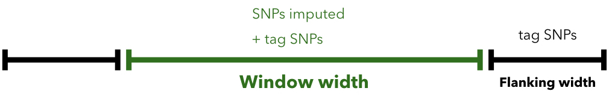
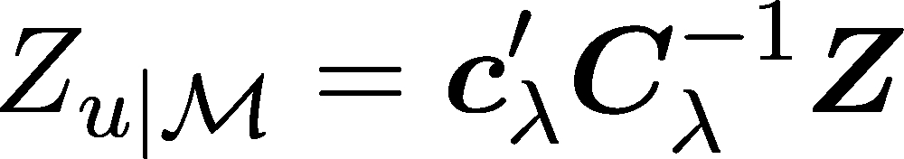
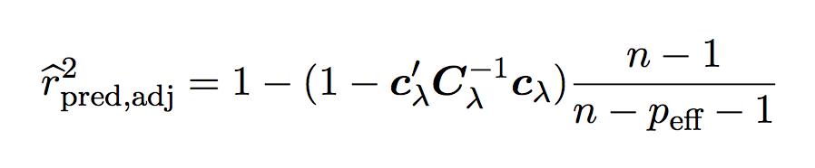

[//]: ==================================
# Manual of SSimp
[//]: ==================================


## Minimal example
[//]: -------------------------------
The minimal requirements are for `ssimp` to run are: (1) GWAS summary statistics stored in a text file with at least the following columns SNP-id (e.g. `MarkerName`), Z-statistic (e.g. `Z`), reference allele (e.g. `a1`) and risk allele (e.g. `a2`) and at least one row, (2) the path to the reference panel, and (3) the path to the output file.

`ssimp my_gwas.txt ~/.refpanel/my_reference_panel.vcf output.txt` will generate a file `output.txt`, containing the imputation results. This is identical to 

`ssimp --gwas my_gwas.txt --ref ~/.refpanel/my_reference_panel.vcf --out output.txt`

<sup>If P-values are provided instead Z-statistics, there needs to be an extra column containing the effect sizes (the P-value will be turned into a Z-statistic, and therefore needs a negative sign if the effect size is negative). </sup>
	

## Arguments
[//]: -------------------------------
Here are all parameters listed. Each argument has: a default value defined (in `[brackets]`), valid options listed and a definition of the argument given. Note that arguments can be shortend, e.g. `--wind` instead of `--window.width`.

`--gwas [no default]`, filename of the GWAS dataset, extension (e.g. `.txt`) does not matter. The delimiter (comma, space or tab) is detected automatically. Common column names are recognized automatically (see file `../header_translation.md` ). Missings have to be marked as `NA` or left empty. Column names in QUICKTEST, SNPTEST, METAL AND PLINK output files will be automatically recognised. The minimal set of columns that should be provided, are: SNP-id, Z-statistics, reference allele and risk allele. For more info on possible sets of columns, see section `GWAS dataset` below.

`--ref [no default]` path to vcf file (same folder should contain the `tbi` file). **Important** >> currently, there is a default to use the 1KG reference panel (503 EUR) on HPC1. For more info see section `reference panel` below.

`--sample.names [no default]`  The argument can be used in two ways: (1) providing a text file (no header) with sample id's separated by new lines `--sample.names filename.samples.txt` or (2) providing a file with at least a sample id column and a column to constrain on: `--sample.names  x/f/e=v` does a lookup in file 'x' (which has a header), but filters on field 'e' being equal to value 'v', and then
use the sample names in column 'f'. An example of the latter is: `/data/sgg/aaron/shared/ref_panels/1kg/integrated_call_samples_v3.20130502.ALL.panel/sample/super_pop=EUR`. **Important** >> currently this argument is defaulted to `super_pop=EUR`. 

`--out [gwasfilename.ssimp.txt]` string. Filename in which to store the imputation results. If not defined, it will be the gwas filename + `.ssimp.txt`. 

`--log [no default]` string. Filename in which to store the log file - this is simply a copy of whatever is printed to the console.

`--impute.range [no default]` Should have the form of `CHR:pos.start-CHR:pos.end`, with `CHR` being the chromosome number, `pos.start` the start position and `pos.end` the end position, e.g. `1:10000-1:30000`. If `CHR`, then the single chromosome `CHR` is imputed. For `CHR-CHR`, a range of chromosomes are imputed, e.g. `1-5` chromosome 1 to chromosome 5 are imputed. (**TBD** >> For chromosome `X`, `Y` and `MT`, text or numbers (23, 24, 25) can be used.)

`--tag.snp [no default]` filename with list of tags (no header). For magic in bash see `Note` below.

`--impute.snp [NULL]` filename to define SNPs to impute (no header). For magic in bash see `Note` below.

`--lambda [2/sqrt(n)]` numeric value or string (`2/sqrt(n)`, `optimise`), n are the number of individuals in the reference panel. Lambda controls the shrinking of the correlation matrix (lambda = 0 applies no shrinking, lambda = 1 turns the correlation matrix into the identity matrix). (`optimise` not yet implemented. )

`--impute.maf [0]` numeric value. Lower MAF limit for SNPs to be imputed: everything above and equal this threshold will be imputed.

`--tag.maf [0]` numeric value. Lower MAF limit for tag SNPs: everything above and equal this threshold will be used as tag SNPs. 

`--window.width [1000000]` numeric value. Core window length.

`--flanking.width [250000]` numeric value. Flanking space left and right of the core window.
		
`--missingness [none]` string, ind, dep. Enables variable sample size approach. `ind` stands for independent, and `dep` for dependent. We recommend `ind` (as its... ). This is automatically set to `ind` if `N` is not provided or `N` is set to `NA`.

`--n.cores [1]` Number of cores to use.**TBD** 

### Note	
[//]: -------
- If `impute.range` and `impute.snps` are not defined, then all variants in the reference panel are imputed (including the tag SNPs, see section `output` below).
- The option `missingness` is automatically set to `FALSE` if `N` is not provided or `N` is set to `NA`.
- Odds ratios need to be provided as Z-statistics or, alternatively, be log-transformed into effect sizes.
- Magic tipp in bash to produce a file within the command line: `--impute.snp <(echo rs5753220 rs5753231 | tr ' ' '\n')`

## Version (hg18, hg19, hg20)

| UCSC      |                                    |
| --------- |:----------------------------------:| 
| hg20      | Genome Reference Consortium GRCh38 | 
| hg19      | Genome Reference Consortium GRCh37 | 
| hg18      | NCBI Build 36                      |   

## GWAS dataset
[//]: -------------------------------
- Column names are automatically recognised using commonly used names. The file [file.reading.cc](https://github.com/sinarueeger/ssimp_software/blob/master/src/file.reading.cc) contains all possibilities (look for the keyword `is_in_this_list_CASEINSENSITIVE`). For example, the Z-statistics column can be termed `z.from.peff`, `z`, `stat`, `zscore` or `z.score`. 
- Missing values should be marked as `NA` or left empty. 
- The minimal columns required are `SNP`, `A1`, `A2`, `Z`. If `Z` is not present, but `P` and `b` are, `Z` is calculated through `P` and `b`. Alternatively, if `b` and `SE` are present, then it is also possible to calculate `Z` via `b` and `SE`. 
- Positions should match the positions in the reference panel (e.g. both hg19). 
- It is recommended to provide the sample size (N), as incorporating missingness leads to a more accurate estimate. 
- SNP names should be named so they match the SNP-id in the reference panel. 
- If case positions in the GWAS file do not match the reference panel positions, use use LiftOver as a command line tool: http://genome.ucsc.edu/cgi-bin/hgLiftOver

## --window.width and --flanking.width
[//]: -------------------------------


## Reference panel
[//]: -------------------------------
Filename specified as `ref/chr{CHRM}.vcf.gz`, with `CHRM` as the placeholder if the vcf.gz files are split up for each chromosome. The same folder should contain also the `.tbi` file(s).

More info on handling reference panel data can be found starting from line 49 in [usage message](https://github.com/sinarueeger/ssimp_software/blob/master/docu/usage.txt).

## Run-time
[//]: -------------------------------
To run a genome-wide imputation using 1000genomes, roughly 200 CPU hours are needed.
```diff 
- sina check
```

## Method outline
[//]: -------------------------------
Briefly, by combining summary statistics for a set of variants and the fine-scale LD structure in the same region, we can estimate summary statistics of new, untyped variants at the same locus. We can formally write this using the conditional expectation of a multivariate normal distribution. 

### Impute Z-statistics



Here we aim to impute the Z-statistic of an untyped SNP *u*, given the Z-statistics of a set of tag SNPs called *M* (LHS of the equation). The RHS of the equation contains **c** (representing the correlations between SNP *u* and all the tag SNPs *M*), *C* (the pairwise correlations among the tag SNPs), and the Z-statistics of a set of tag SNPs *M*. Both, *c* and *C* are regularised using the option `--lambda`. *u* can be extended to a vector. *M* includes SNPs among `--window.width` + left and right `--flanking.region`, whereas the core window (`--window.width`) only covers SNPs to impute. 

### Imputation quality
We use an adjusted imputation quality that corrects for the effective number of tag SNVs *p.eff*.


### Variable missingness
To account for variable sample size in summary statistics of tag SNVs, we use an approach to down-weight entries in the *C* and *c* matrices for which summary statistics was estimated from a GWAS sample size lower than the maximum sample size in that data set.

### More background on method

For more details on *summary statistics imputation*, please see *our paper (2017)* or (for a shortened method version) our *application paper (2017)*. 

Most of our method builds on *Pasaniuc et al. (2014)*. 

We also recommend reading the review on the use of summary statistics by *Pasaniuc & Price (2016)*).


## Technical aspects
[//]: -------------------------------

- If SNP-ID are present in the GWAS, then positions (bp) are copied from reference panel. 
- If SNP-ID are not present, then the combination of Chr:Pos:A1:A2 are taken as identifier
- Because either SNP-ID or Chr:Pos:A1:A2 are used as identifier, it is also possible to impute indels.
- Z-statistics are imputed, along with `N_imp` (an estimate for the sample size) and `r2_pred` (adjusted imputation quality).
- To speed up computation, we use a sliding window approach (`--window.width` and `--flanking.width`). SNPs to be imputed are assigned to one window.

## Output
[//]: -------------------------------

### log file
[//]: -------
The `.log` file is a copy of what is printed to the console. (not supported yet)

### out file
[//]: -------
The `.ssimp.txt` file has the following columns:

- `SNP` SNP-ID
- `Chr` Chromosome (only 1 to 22 right now)
- `Pos` Position (same build as reference panel)
- `Z_imp` Imputed Z statistics (see below)
- `N_imp` Estimation of N (only if missingness was set to `TRUE`)
- `r2_pred` Imputation quality (adjusted as in ...)
- Reference allele (same column name as in the GWAS file)
- Effect allele (same column name as in the GWAS file)
- `lambda` lambda used to impute
- `origin` GWAS or SSimp, depending if the SNP was a tag SNP or an imputed SNP. 
- `Z_reimputed` for the first window, all tag SNPs will be re-imputed (sanity check).

`Z_imp` reports the imputed Z-statistics for SNPs that were imputed (`origin = SSimp`), as well as the GWAS Z-statistics for tag SNPs (`origin = GWAS`). 

## References
[//]: -------
**Pasaniuc, B. and Price, A. L. (2016).** *Dissecting the genetics of complex traits using summary association statistics.* Nature Reviews Genetics.

**Pasaniuc, B., Zaitlen, N., Shi, H., Bhatia, G., Gusev, A., Pickrell, J., Hirschhorn, J., Strachan, D. P., Patterson, N., and Price, A. L. (2014).** *Fast and accurate imputation of summary statistics enhances evidence of functional enrichment.* Bioinformatics.

